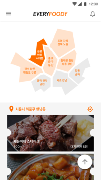

# # Every Foody


서울시 앱 공모전에 진행한 프로젝트로 푸드트럭 순번 예약이 주 목적인 서비스입니다.

앱은 사용자와 사업자 두 가지 모드로 나뉘어 사용됩니다.

## # 주요기능

* 일반 이용자
  * 지역을 선택하여 해당 지역 내 푸드트럭 리스트를 확인
  * 원하는 푸드트럭의 메뉴, 영업시간, 현재 위치와 오픈 상태를 확인
  * 후기 작성 및 다른 사용자 후기 확인
  * 내 주변 푸드트럭 확인
  * 푸드트럭 순번 예약
* 사업자
  * 푸드트럭 운영 시작 시, 가게의 상태를 오픈으로 변경하여 즐겨찾기한 사용자들에게 알림
  * 현재 순번 내역을 확인하고, 순번 호출 버튼을 통해 다음 순번에게 알림을 전송 ( FCM 사용 )


## # MapClipDataHelper 클래스



위 이미지는 EveryFoody 일반 사용자 메인 화면입니다.

지도 선택 시 텍스트와 이미지의 변화 단순하게 구현하기에 하드 코딩이 예상되어 제작한 클래스입니다.


[1] MapClipDataHelper 클래스 생성

다음 클래스는 지도에 필요한 TextView 와 ImageView 를 Tag 명을 키로 각각 String[] ( 지도에 표시될 지역 이름 ), 

Integer[] ( 지도에 표시될 Image 의 Resource ID) 를 Value 로 하여 SparseArray에 저장합니다.

````java
public class MapClipDataHelper {

    private static SparseArray<String[]> locationTextInfo;
    private static SparseArray<Integer[]> locationImageInfo;

    public static void initialize() {
        locationTextInfo = new SparseArray<>();
        locationImageInfo = new SparseArray<>();
        
        // 각 텍스트위 이미지를 xml 에서 지정한 tag 를 키로하여 SparseArray 에 저장		 //	합니다 ( 생략 )
    }
}
````


[2] MapClipDataHelper Init()

다음은 지도가 위치한 메인 액티비티입니다.

````java
//MapClipDataHelper 클래스를 초기화하고 필요한 뷰 객체를 생성하는 함수입니다.
private void init(){
     MapClipDataHelper.initialize();

     mapClipTextViews = new TextView[MAP_CLIP_COUNT];
     mapClipImageViews = new ImageView[MAP_CLIP_COUNT];
     View mapClipContainer = findViewById(R.id.map_clip_container);
     for (int i = 0; i < MAP_CLIP_COUNT; i++) {
       TextView childMapClipTextView = mapClipContainer.findViewWithTag((i + 1) + "");
       ImageView childMapClipImageView = mapClipContainer.findViewWithTag("area" + (i + 1));
	   // ClickListener 를 설정하고 반복문 위 뷰 배열에 반복문의 결과를 세팅합니다.
    }
}
````


[3] ClickListener 의 설정

````java
// 클릭 리스너입니다
private View.OnClickListener mapClipClickListener = new View.OnClickListener() {
        @Override
        public void onClick(View view) {
            int key = Integer.parseInt((String) view.getTag());
			// 클릭한 뷰의 태그명을 얻어와 맵을 체크하는 checkMap 함수를 호출합니다.
            if (lastClickedMapPosition == key)
                return;

            checkMap(key);
        }
    };
````


[4] checkMap 함수의 호출, 뷰 상태 변경

````java
// 맵의 이미지와 텍스트를 변경하는 함수입니다.
private void checkMap(int key) {
        if (lastClickedMapPosition == key)
            return;
    	//key 를 인덱스로 위에서 init 한 뷰 배열의 뷰 객체를 불러와 텍스트와 이미지를 설정합니다.
        ImageView clickedAreaImageView = mapClipImageViews[key - 1];
        TextView clickedAreaTextView = mapClipTextViews[key - 1];
        clickedAreaTextView.setTextColor(getResources().getColor(R.color.colorPrimary));
        clickedAreaImageView.setImageResource(MapClipDataHelper.getMapImage(key, false));
		//바뀌기 이전의 key(lastClickedMapPosition)는 MapClipDataHelper 클래스 내
        // SparseArray 의 key 입니다. 해당 key 로 value 에 해당하는 설정 값을 불러와 텍스트와 이미지를 		  변경합니다.
        ImageView lastClickedImageView = mapClipImageViews[lastClickedMapPosition - 1];
        TextView lastClickedTextView = mapClipTextViews[lastClickedMapPosition - 1];
        lastClickedTextView.setTextColor(getResources().getColor(R.color.colorAccent));      lastClickedImageView.setImageResource(MapClipDataHelper.getMapImage(lastClickedMapPosition, true));

    	//해당 지역의 푸드트럭 리스트 호출
        getMainData(key);
		
    	// 마지막 클릭한 지역 재설정
        lastClickedMapPosition = key;
    }
````

다음의 클래스를 활용하여 지역 선택간의 발생하는 하드코딩을 해결하였습니다.


